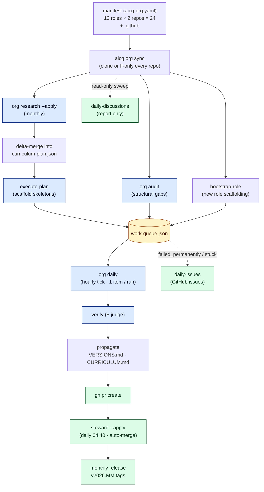
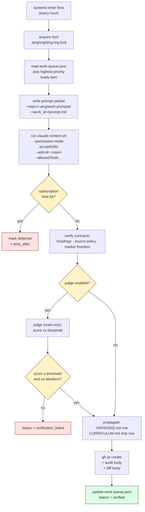
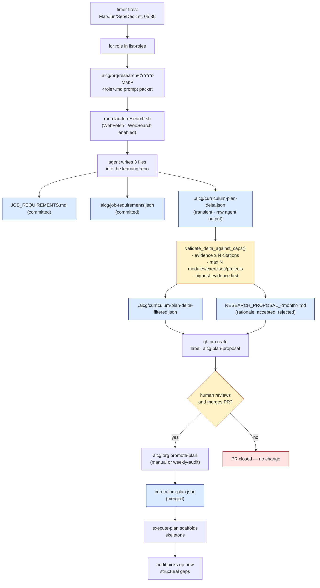
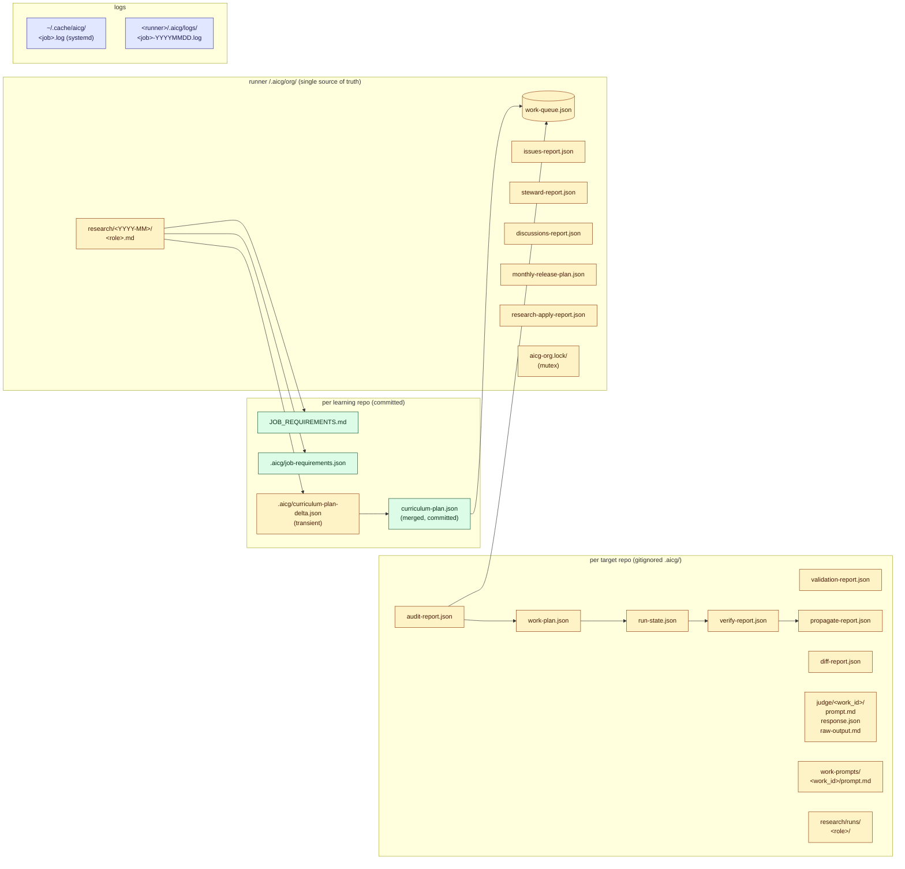
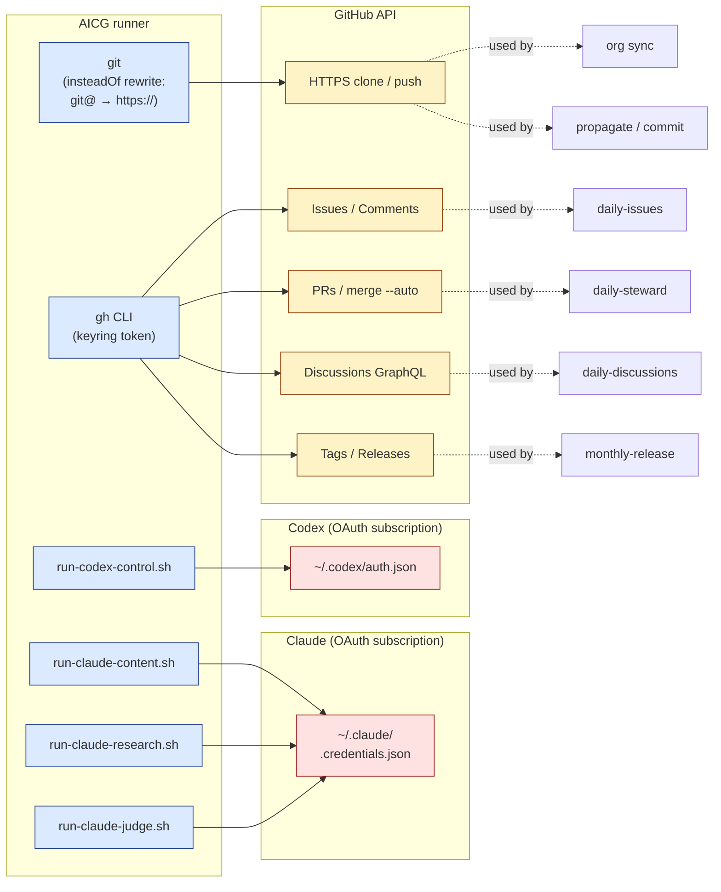
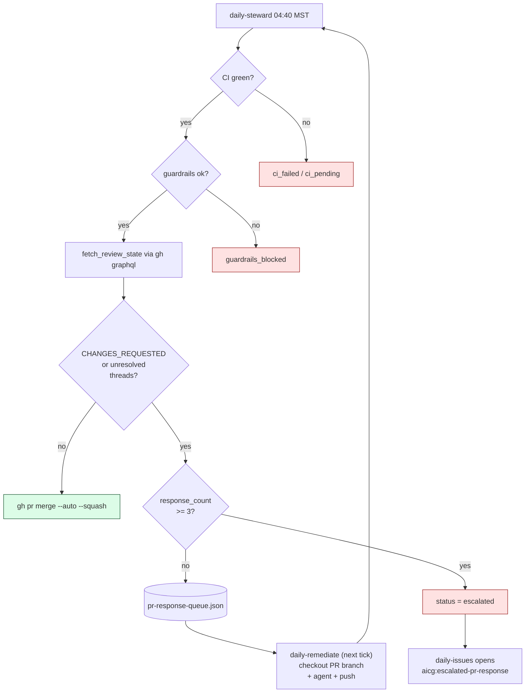

# AICG Runner Architecture

End-to-end view of the AI Infrastructure Curriculum runner: how the
pieces hang together, what fires when, and where data lives.

For day-to-day operations, see [RUNBOOK.md](RUNBOOK.md). For the
autonomous-mode reference, see [AUTONOMOUS_ORG_AUTOMATION.md](AUTONOMOUS_ORG_AUTOMATION.md).

---

## 1. The orchestration loop

The high-level chain: research updates the plan → plan scaffolds
skeletons → audit finds gaps → daily remediate fills them → steward
merges → monthly release tags everything.



---

## 2. Timer cadence

Local time on the SBC is `America/Phoenix` (MST, no DST).

```mermaid
timeline
    title AICG systemd timers (local MST)
    section Hourly
        00:00 → 23:00 : daily-remediate (every hour, on the hour)
    section Daily (early morning)
        04:20 : daily-issues (--apply)
        04:40 : daily-steward (--apply)
        05:00 : daily-discussions (dry-run)
    section Weekly
        Sun 03:00 : weekly-audit (sync + audit-links + audit-versions + audit)
    section Monthly
        1st 02:00 : monthly-release (sync + release --apply)
    section Quarterly
        Mar/Jun/Sep/Dec 1st 05:30 : monthly-research (writes proposals, opens PRs, NO auto-merge)
        Mar/Jun/Sep/Dec 1st 06:00 : monthly-review (LLM freshness review across all solutions)
    section One-off override
        2026-06-15 02:00 : monthly-release shifted from June 1 to give the cold-start drain runway
```

The freshness audits flow into the work queue alongside structural
gaps. High-severity refresh items (broken security guidance, EOL'd
tools, dead citations) jump above new-content gaps via a priority
bias; medium and low severities sit below structural work and get
worked when the queue is otherwise drained.

---

## 3. `daily-remediate` (hourly) — work-item lifecycle

One ready item per hourly tick. Subscription-limit-aware: deferred
items resume after their `retry_after` timestamp.



---

## 4. `monthly-research --apply` — proposal-only research loop

Runs the 1st of Mar/Jun/Sep/Dec at 05:30. **The runner never adds
modules, exercises, or projects to the curriculum on its own.** Every
proposal goes through a human-reviewable PR. Caps from the manifest
prevent the agent from drowning the PR with weakly-justified
additions.



---

## 5. State-file data flow

Each target repo has its own gitignored `.aicg/` diary. The runner
itself owns a separate `.aicg/org/` directory that is the single
source of truth for org-wide state.



---

## 6. External service surface

The runner has exactly three external dependencies. Everything else is
on-disk file manipulation.



---

## Permission boundaries (what the runner refuses to do autonomously)

| Surface | Allowed | Refused |
|---|---|---|
| Target repo files | `Read`, `Edit`, `Write`, `Glob`, `Grep` | anything outside `--add-dir` |
| Bash in agent | `mkdir`, `ls`, `cat`, `git status`, `git diff` | everything else |
| `CURRICULUM.md` / `README.md` | Append rows to `## Shipped (autonomous)` section in CURRICULUM.md only | Direct edits anywhere else |
| `VERSIONS.md` | Append rows under current month heading | Modify historical rows |
| `curriculum-plan.json` | Additive delta merge (new modules/exercises/projects) | Remove or modify existing items |
| GitHub Discussions | Read via GraphQL | Comments, resolutions |
| Git | `clone`, `pull --ff-only`, `commit`, `push origin <branch>`, `tag` | `push --force`, `reset --hard`, `--no-verify`, branch deletion |
| Judge agent | `Read`, `Glob`, `Grep` | `Edit`, `Write` (explicitly denied) |

The runner never uses `--dangerously-skip-permissions` / `--dangerously-bypass-approvals-and-sandbox`.

---

## Failure modes and recovery

| Symptom | Cause | Recovery |
|---|---|---|
| Item stays `deferred` indefinitely | Claude subscription weekly cap hit | Wait for `retry_after`; next hourly tick resumes automatically |
| Item flips to `failed_permanently` after retries | Opaque agent error N times | `daily-issues` opens a GitHub issue with the work_id; human triage |
| `verification_failed` | Contract violation (missing heading, leaked marker, etc.) | Issue auto-opened; fix the prompt or work plan, mark item `ready` |
| Steward sees `ci_failed` | Tests broke from generated content | PR sits open; human investigates; once fixed, next steward tick merges |
| Curriculum-plan-delta merge fails | Malformed JSON from research agent | Reported in `research-apply-report.json`; plan file untouched |
| Two job-script runs collide | systemd timer overlap | Second run sees `.aicg/org/aicg-org.lock/` and exits 0 |
| PR sits in `review_blocked` after 3 auto-respond attempts | Reviewer keeps requesting changes the agent can't satisfy | Item flips to `escalated`; `daily-issues` opens an `aicg:escalated-pr-response` issue with the blocker list |

---

## PR-response loop

`daily-steward` doesn't just poll CI. After CI passes + guardrails clear,
it fetches reviews and review threads via `gh api graphql` and blocks
auto-merge on:

- A review in `CHANGES_REQUESTED` state (human or bot)
- An unresolved, non-outdated review thread (human or bot)

Blocked PRs become `respond_pr_review` work items in
`.aicg/org/pr-response-queue.json`. The next `daily-remediate` tick
picks them up at priority bias **-200000** (jumps every other type),
checks out the PR branch, invokes the agent with the full blocker list,
and pushes follow-up commits to the same branch.

The next steward pass re-checks. Bot threads typically self-resolve
when the underlying metric recovers (codecov stops complaining); human
review threads stay open until a human resolves them — the runner
never marks human threads resolved.

After **3 failed response attempts** for the same blocker signature,
the item becomes `escalated` and `daily-issues` opens an
`aicg:escalated-pr-response` issue so a human can step in.



---

## Related docs

- [RUNBOOK.md](RUNBOOK.md) — operator playbook (one-page how-to)
- [AUTONOMOUS_ORG_AUTOMATION.md](AUTONOMOUS_ORG_AUTOMATION.md) — autonomous-mode reference
- `config/aicg-org.yaml` — single-source-of-truth manifest
- `scripts/install-schedules.sh` — timer installer
- `scripts/aicg-org-job.sh` — job wrapper invoked by every timer
