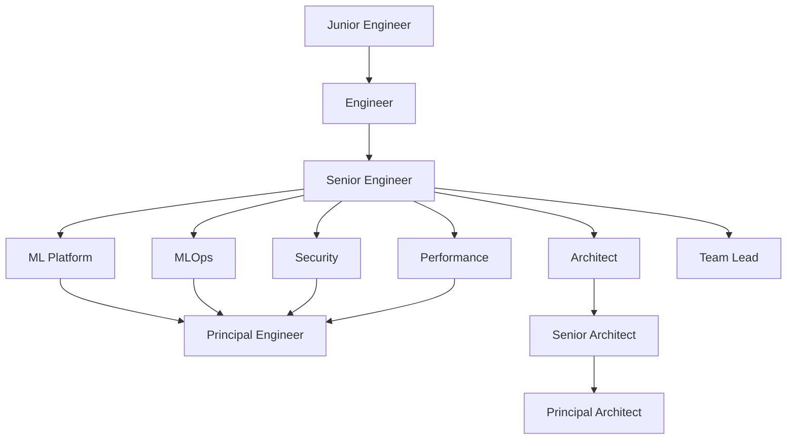

# Implementation Recommendations

**Version**: 1.0
**Date**: 2025-11-04
**Purpose**: Critical recommendations to ensure successful content generation for the AI Infrastructure Curriculum

---

## Executive Summary

This document provides actionable recommendations to maximize success when using this framework to generate curriculum content for all 12 AI Infrastructure roles. Based on analysis of the framework structure and the scope of the project (24 repositories, 100-120 modules, 1.7-2.2M words), these recommendations address critical risk areas and success factors.

**Key Metrics**:
- 🎯 **Scope**: 12 roles, 24 repositories, ~49 projects, ~110 modules
- 📝 **Content Volume**: 1.7-2.2 million words, 275K-375K lines of code
- ⏱️ **Estimated Effort**: 502-748 hours with AI assistance
- 🚀 **Time Savings**: 70-75% vs manual creation

---

## Table of Contents

1. [Critical Success Factors](#critical-success-factors)
2. [Before You Start](#before-you-start)
3. [MCP Server Setup](#mcp-server-setup)
4. [Workflow Execution Strategy](#workflow-execution-strategy)
5. [Quality Assurance](#quality-assurance)
6. [Risk Mitigation](#risk-mitigation)
7. [Checkpoint and Resume Strategy](#checkpoint-and-resume-strategy)
8. [Content Generation Order](#content-generation-order)
9. [Resource Management](#resource-management)
10. [Testing and Validation](#testing-and-validation)
11. [Common Pitfalls](#common-pitfalls)
12. [Success Metrics](#success-metrics)

---

## Critical Success Factors

### 1. Set Up MCP Servers BEFORE Starting

**Priority 1 - CRITICAL (Must Have)**:
- ✅ **GitHub MCP Server** - For creating and managing 24 repositories
- ✅ **Memory MCP Server** - For maintaining state across sessions
- ✅ **Filesystem MCP Server** - For managing complex directory structures
- ✅ **PostgreSQL/SQLite MCP Server** - For structured data (skills matrices, curriculum mapping)

**Priority 2 - HIGH (Quality Assurance)**:
- ✅ **Quality Guard MCP** - Automated linting and validation
- ✅ **MCP Code Checker** - Python code validation
- ✅ **Ruff MCP Server** - Fast Python linting

**Why This Matters**:
- Without these servers, you'll need manual file operations for ~200+ directories
- Memory MCP is critical for resuming work across 10-15 sessions
- GitHub MCP enables batch repository creation (saves 15-20 hours)

**Installation Guide**: See `/home/claude/ai-infrastructure-project/RECOMMENDED_TOOLS_REPORT.md`

---

### 2. Start Small, Then Scale

**Recommended Approach**:

**Phase 1: Single Module Proof of Concept (Week 1-2)**
```bash
# Generate ONE complete module for ONE role
# Example: Junior Engineer, Module 01 (Python Fundamentals)

1. Use templates/lecture-notes/ to generate lecture (12,000 words)
2. Create 5-7 exercises with templates/exercises/
3. Generate solution with templates/solutions/
4. Validate with validation/content-checkers/
5. Review quality and adjust templates/prompts as needed
```

**Phase 2: Single Role Complete (Week 3-6)**
```bash
# Complete ONE full role (Junior Engineer)
# 10 modules + 4 projects + assessments

- Apply lessons from Phase 1
- Establish checkpoint rhythm (after each module)
- Build quality feedback loop
- Estimate actual time per module
```

**Phase 3: Scale to All Roles (Week 7-18)**
```bash
# Once process is proven:
# - Run multiple roles in parallel
# - Use Multi-role alignment dashboard
# - Coordinate shared assets
# - Maintain consistency
```

**Why This Matters**:
- Jumping straight to all 12 roles risks compounding errors
- Templates need iteration based on actual generation results
- You'll discover gaps in prompts and workflows early

---

### 3. Use the Multi-Role Alignment Dashboard

**Location**: `templates/curriculum/multi-role-alignment-template.md`

**Critical Updates to Track**:
```markdown
## Module Assignment Matrix

| Module | Junior | Engineer | Senior | ML Platform | MLOps | Security | Performance | Architect | ... |
|--------|--------|----------|--------|-------------|-------|----------|-------------|-----------|-----|
| Python Fundamentals | ✅ | ❌ | ❌ | ❌ | ❌ | ❌ | ❌ | ❌ | ... |
| Kubernetes Basics | ❌ | ✅ | ✅ | ✅ | ✅ | ✅ | ✅ | ✅ | ... |

## Shared Assets Register

| Asset | Type | Owner | Used By | Location |
|-------|------|-------|---------|----------|
| Docker basics module | Module | Junior Eng | All roles | shared/docker-basics/ |
| K8s deployment template | Code | Engineer | 8 roles | shared/templates/k8s/ |
```

**Why This Matters**:
- Prevents duplicate content creation (saves 50-100 hours)
- Ensures consistency across roles
- Identifies reusable components early

---

### 4. Establish Checkpoint Discipline

**Checkpoint After Every**:
- ✅ Each module completed (10-12 per role = 100-120 checkpoints)
- ✅ Each project completed (4-5 per role = 45-55 checkpoints)
- ✅ End of each role (12 checkpoints)
- ✅ End of each phase (6 major checkpoints)

**Checkpoint Naming Convention**:
```bash
# Format: phase-role-asset-status
checkpoint-phase3-junior-engineer-module-01-complete
checkpoint-phase3-junior-engineer-modules-01-05-complete
checkpoint-phase3-junior-engineer-complete
checkpoint-phase3-core-track-complete
```

**Use Memory MCP Server**:
```json
{
  "checkpoint_id": "phase3-junior-engineer-module-01-complete",
  "timestamp": "2025-11-04T10:30:00Z",
  "phase": "Phase 3: Learning Content Generation",
  "role": "junior-engineer",
  "module": "01-python-fundamentals",
  "status": "complete",
  "artifacts": [
    "lessons/01-foundations/lecture-notes.md",
    "lessons/01-foundations/exercises/",
    "lessons/01-foundations/assessments/"
  ],
  "validation": {
    "word_count": 13245,
    "code_examples": 12,
    "exercises": 7,
    "validation_passed": true
  },
  "next_task": "module-02-linux-essentials"
}
```

**Why This Matters**:
- Long-running project (500-750 hours) requires session management
- Prevents losing work if sessions timeout
- Enables parallel work by multiple agents/sessions
- Provides progress tracking for stakeholders

---

### 5. Quality Gate at Each Phase

**Phase Gate Checklist**:

**Before Moving to Next Phase**:
```markdown
### Phase 1 → Phase 2 Gate
- [ ] All 12 roles researched
- [ ] Skills matrices validated by SMEs (if available)
- [ ] Job posting analysis complete (≥20 postings per role)
- [ ] Technology stacks documented
- [ ] Multi-role alignment dashboard initialized

### Phase 2 → Phase 3 Gate
- [ ] Master plan approved for all 12 roles
- [ ] Module roadmaps complete
- [ ] Project plans documented
- [ ] Repository strategy finalized
- [ ] Shared assets identified

### Phase 3 → Phase 4 Gate
- [ ] Sample module passes validation (12K+ words, 10+ examples)
- [ ] Exercise format approved
- [ ] Assessment template validated
- [ ] Code quality standards met
- [ ] One complete role as reference

### Phase 4 → Phase 5 Gate
- [ ] All projects have starter code with TODOs
- [ ] Implementation guides complete
- [ ] Assessment rubrics defined
- [ ] Projects build progressively

### Phase 5 → Phase 6 Gate
- [ ] All solutions implemented
- [ ] Code quality checks pass
- [ ] Solutions validated (tests pass)
- [ ] Documentation complete

### Phase 6 → Release Gate
- [ ] QA report reviewed
- [ ] All validation checks pass
- [ ] Security scans complete
- [ ] Repository permissions configured
- [ ] Changelog updated
```

**Why This Matters**:
- Prevents cascading errors (fixing module 1 issues in module 100 is expensive)
- Ensures quality bar is maintained
- Provides clear decision points for stakeholders

---

## Before You Start

### Pre-Flight Checklist

**Environment Setup** (Day 1):
```bash
# 1. Verify MCP servers are installed
claude-code mcp list

# 2. Test critical servers
claude-code mcp test github
claude-code mcp test memory
claude-code mcp test filesystem

# 3. Create project structure
mkdir -p /home/claude/ai-infrastructure-project/{research,curriculum,projects,memory}

# 4. Clone content generator
cd /home/claude/ai-infrastructure-project
git clone https://github.com/ai-infra-curriculum/ai-infra-content-generator.git

# 5. Set environment variables
export GITHUB_TOKEN="your_token"
export GITHUB_ORG="ai-infra-curriculum"
export PROJECT_ROOT="/home/claude/ai-infrastructure-project"
```

**Documentation Review** (Day 2):
```bash
# Read these files in order:
1. docs/getting-started.md (8,300 words - 30 min)
2. docs/ai-infrastructure-curriculum-guide.md (COMPLETE playbook - 60 min)
3. docs/architecture.md (12,500 words - 45 min)
4. workflows/multi-role-program.md (coordination - 30 min)
5. docs/best-practices.md (15,400 words - 60 min)

Total reading time: ~4 hours
```

**Template Customization** (Day 3):
```bash
# Customize templates for your content style:
1. Review templates/lecture-notes/comprehensive-lecture-template.md
2. Adjust prompts/lecture-generation/comprehensive-module-prompt.md
3. Test with ONE module before scaling
4. Iterate based on output quality
```

---

## MCP Server Setup

### Installation Script

```bash
#!/bin/bash
# install-mcp-servers.sh

echo "Installing Critical MCP Servers..."

# Priority 1: Critical
npm install -g @modelcontextprotocol/server-github
npm install -g @modelcontextprotocol/server-memory
npm install -g @modelcontextprotocol/server-filesystem
npm install -g @modelcontextprotocol/server-postgres

# Priority 2: Quality Assurance
npm install -g @mojoatomic/quality-guard-mcp
npm install -g @MarcusJellinghaus/mcp-code-checker
npm install -g @drewsonne/ruff-mcp-server

echo "Configuring MCP servers..."

# Create config file
cat > ~/.config/claude-code/mcp.json <<'EOF'
{
  "mcpServers": {
    "github": {
      "command": "npx",
      "args": ["-y", "@modelcontextprotocol/server-github"],
      "env": {"GITHUB_TOKEN": "${GITHUB_TOKEN}"}
    },
    "memory": {
      "command": "npx",
      "args": ["-y", "@modelcontextprotocol/server-memory",
               "--memory-path", "${PROJECT_ROOT}/memory"]
    },
    "filesystem": {
      "command": "npx",
      "args": ["-y", "@modelcontextprotocol/server-filesystem",
               "${PROJECT_ROOT}"]
    },
    "postgres": {
      "command": "npx",
      "args": ["-y", "@modelcontextprotocol/server-postgres"],
      "env": {"POSTGRES_CONNECTION_STRING": "${POSTGRES_CONNECTION_STRING}"}
    },
    "quality-guard": {
      "command": "npx",
      "args": ["-y", "@mojoatomic/quality-guard-mcp"]
    },
    "code-checker": {
      "command": "npx",
      "args": ["-y", "@MarcusJellinghaus/mcp-code-checker"]
    },
    "ruff": {
      "command": "npx",
      "args": ["-y", "@drewsonne/ruff-mcp-server"]
    }
  }
}
EOF

echo "MCP servers installed and configured!"
echo "Test with: claude-code mcp list"
```

### Configuration Validation

```bash
# validate-mcp-setup.sh
#!/bin/bash

echo "Validating MCP Server Setup..."

# Test each server
for server in github memory filesystem postgres quality-guard code-checker ruff; do
    echo "Testing $server..."
    claude-code mcp test $server
    if [ $? -eq 0 ]; then
        echo "✅ $server working"
    else
        echo "❌ $server FAILED - check configuration"
    fi
done

echo "Validation complete!"
```

---

## Workflow Execution Strategy

### Recommended Execution Order

**Week 1-2: Foundation**
```bash
Phase 0: Program Setup (4 hours)
├── Initialize all 12 role directories
├── Configure MCP servers
├── Set up checkpoint system
└── Create multi-role alignment dashboard

Phase 1: Research - Core Track Only (24 hours)
├── Junior Engineer (8 hours)
├── Engineer (8 hours)
└── Senior Engineer (8 hours)

Phase 2: Curriculum Design - Core Track (36 hours)
├── Junior Engineer master plan + module roadmaps (12 hours)
├── Engineer master plan + module roadmaps (12 hours)
└── Senior Engineer master plan + module roadmaps (12 hours)
```

**Week 3-6: Core Track Content Generation**
```bash
Phase 3: Learning Content - Junior Engineer ONLY (80 hours)
├── 10 modules × 6 hours = 60 hours
├── Adjustments and refinements = 20 hours
└── CHECKPOINT: Validate quality before proceeding

Phase 3: Learning Content - Engineer + Senior (120 hours)
├── Engineer: 10 modules × 6 hours = 60 hours
└── Senior Engineer: 10 modules × 6 hours = 60 hours

Phase 4: Projects - Core Track (40 hours)
├── Junior Engineer: 4 projects × 3 hours = 12 hours
├── Engineer: 5 projects × 3 hours = 15 hours
└── Senior Engineer: 6 projects × 3 hours = 18 hours
```

**Week 7-8: Core Track Solutions**
```bash
Phase 5: Solutions - Core Track (60 hours)
├── Junior Engineer solutions (15 hours)
├── Engineer solutions (20 hours)
└── Senior Engineer solutions (25 hours)

Phase 6: QA - Core Track (20 hours)
└── Comprehensive validation before scaling
```

**Week 9-18: Specialized, Architecture, and Leadership Tracks**
```bash
# Once core track is proven:

Week 9-12: Specialized Roles (4 roles in parallel)
├── ML Platform Engineer
├── MLOps Engineer
├── Security Engineer
└── Performance Engineer

Week 13-15: Architecture Track (3 roles sequentially)
├── Architect
├── Senior Architect
└── Principal Architect

Week 16-18: Leadership Track + Final QA (2 roles + QA)
├── Principal Engineer
├── Team Lead
└── Final validation and release preparation
```

---

## Quality Assurance

### Validation Checkpoints

**Module-Level Validation** (Run after EVERY module):
```bash
# Automated checks
python validation/completeness/check-module-completeness.py lessons/01-foundations/
python validation/code-validators/validate-code-examples.py lessons/01-foundations/lecture-notes.md

# Manual checks
- [ ] Word count ≥ 12,000 words
- [ ] Code examples ≥ 10 (production-quality)
- [ ] Case studies ≥ 3 (with citations)
- [ ] Exercises: 5-10 with clear objectives
- [ ] Assessment: Quiz + rubric
- [ ] No TODO/placeholder content
- [ ] All code examples tested
```

**Project-Level Validation** (Run after EVERY project):
```bash
# Code quality
pylint src/
ruff check src/
bandit -r src/
pytest tests/ --cov=src --cov-report=html

# Documentation
- [ ] README.md complete
- [ ] Architecture diagrams included
- [ ] API documentation generated
- [ ] Deployment guide complete
- [ ] Troubleshooting section included
```

**Role-Level Validation** (Run after completing each role):
```bash
# Completeness
- [ ] All modules complete (10-12)
- [ ] All projects complete (3-7)
- [ ] All solutions implemented
- [ ] All assessments created
- [ ] Learning repository structure correct
- [ ] Solutions repository structure correct

# Quality
- [ ] Progression logical and clear
- [ ] No duplicate content with other roles
- [ ] Shared assets properly referenced
- [ ] All code passes quality checks
- [ ] All tests passing
```

---

## Risk Mitigation

### Top 10 Risks and Mitigations

**Risk 1: Content Quality Degradation Over Time**
- **Impact**: Later modules have lower quality than earlier ones
- **Mitigation**:
  - Maintain reference examples from Phase 3
  - Run validation after EVERY module
  - Periodic human review (every 10 modules)
  - Quality gates between phases

**Risk 2: Loss of Work Due to Session Timeouts**
- **Impact**: Hours of work lost if not checkpointed
- **Mitigation**:
  - Memory MCP Server required
  - Checkpoint after every major artifact
  - Save state every 2 hours minimum
  - Test resume functionality in Phase 1

**Risk 3: Template Drift**
- **Impact**: Inconsistent content structure across roles
- **Mitigation**:
  - Lock templates after Phase 1 validation
  - Version control all template changes
  - Document any deviations in multi-role dashboard
  - Use git tags for template versions

**Risk 4: Duplicate Content Across Roles**
- **Impact**: Wasted effort, maintenance burden
- **Mitigation**:
  - Multi-role alignment dashboard (required!)
  - Shared assets register
  - Content reuse strategy documented
  - Cross-role validation in Phase 6

**Risk 5: Insufficient SME Review**
- **Impact**: Technical inaccuracies published
- **Mitigation**:
  - Plan SME review cycles in advance
  - Batch review requests (per role completion)
  - Document review feedback
  - Iterate on flagged modules

**Risk 6: GitHub Rate Limiting**
- **Impact**: Repository creation blocked
- **Mitigation**:
  - Use GitHub Enterprise if available
  - Stagger repository creation
  - Cache GitHub operations
  - Have backup creation scripts

**Risk 7: Scope Creep**
- **Impact**: Never-ending content generation
- **Mitigation**:
  - Stick to 12 roles defined
  - No mid-flight role additions
  - Module count ceiling (12 per role)
  - Project count ceiling (7 per role)

**Risk 8: Validation Script Failures**
- **Impact**: Can't verify content quality
- **Mitigation**:
  - Test validators in Phase 1
  - Manual validation procedures documented
  - Multiple validation methods
  - Fallback to human review

**Risk 9: Code Examples Don't Run**
- **Impact**: Broken learning experience
- **Mitigation**:
  - Test ALL code examples before publishing
  - Automated testing in CI/CD
  - Dockerfile for consistent environments
  - Document environment requirements

**Risk 10: Burnout / Project Abandonment**
- **Impact**: Incomplete project delivery
- **Mitigation**:
  - Realistic timeline (18 weeks, not 4)
  - Celebrate milestones (each role completion)
  - Parallel work where possible
  - Regular breaks planned into schedule

---

## Checkpoint and Resume Strategy

### Checkpoint Frequency

**Optimal Checkpoint Strategy**:
```bash
# HIGH FREQUENCY (Every 2-4 hours)
- After each module generation
- After each project generation
- After each solution implementation
- Before running large validation jobs

# MEDIUM FREQUENCY (Daily)
- End of each work session
- After completing multiple small tasks
- Before experimenting with new approaches

# LOW FREQUENCY (Weekly)
- End of each role completion
- End of each phase
- Before major architectural changes
```

### Resume Protocol

**How to Resume After Interruption**:
```bash
# 1. Load checkpoint
python memory/checkpoint-resume.py --checkpoint latest

# 2. Verify state
echo "Last checkpoint: $(cat memory/checkpoints/latest.json | jq .checkpoint_id)"
echo "Next task: $(cat memory/checkpoints/latest.json | jq .next_task)"

# 3. Review completed work
ls -la $(cat memory/checkpoints/latest.json | jq -r '.artifacts[]')

# 4. Continue workflow
# Follow next_task from checkpoint metadata
```

### Checkpoint Metadata Structure

```json
{
  "checkpoint_id": "phase3-engineer-module-05-complete",
  "timestamp": "2025-11-04T14:30:00Z",
  "phase": "Phase 3: Learning Content Generation",
  "track": "Core Infrastructure",
  "role": "engineer",
  "role_index": 2,
  "total_roles": 12,
  "module": "05-docker-containers",
  "module_index": 5,
  "total_modules_for_role": 10,
  "status": "complete",
  "artifacts": [
    "/project/curriculum/engineer/modules/module-05-docker/lecture-notes.md",
    "/project/curriculum/engineer/modules/module-05-docker/exercises/",
    "/project/curriculum/engineer/modules/module-05-docker/assessments/"
  ],
  "validation": {
    "word_count": 13845,
    "code_examples": 14,
    "exercises": 8,
    "assessments": 2,
    "validation_passed": true,
    "validation_timestamp": "2025-11-04T14:25:00Z"
  },
  "statistics": {
    "modules_completed": 5,
    "modules_remaining": 5,
    "role_completion_percentage": 50,
    "overall_completion_percentage": 4.2,
    "estimated_hours_remaining": 580
  },
  "next_task": {
    "phase": "Phase 3",
    "role": "engineer",
    "module": "06-kubernetes-basics",
    "action": "Generate lecture notes using template",
    "estimated_hours": 6
  },
  "dependencies": [],
  "notes": "Module 05 validated successfully. Ready for module 06.",
  "session_info": {
    "session_id": "session-2025-11-04-001",
    "agent": "content-generation-agent",
    "mcp_servers_used": ["filesystem", "memory", "quality-guard"]
  }
}
```

---

## Content Generation Order

### Recommended Sequence

**PRIORITY 1: Core Track (Foundation for All)**
1. Junior Engineer (Entry point)
2. Engineer (Build on Junior)
3. Senior Engineer (Advanced core skills)

**PRIORITY 2: Specialized Roles (Parallel After Core)**
4-7. ML Platform, MLOps, Security, Performance (Can run in parallel)

**PRIORITY 3: Architecture Track (After Specialized)**
8. Architect (Build on Senior Engineer + Specialized)
9. Senior Architect (Build on Architect)
10. Principal Architect (Build on Senior Architect)

**PRIORITY 4: Leadership Track (Last)**
11. Principal Engineer (Requires all technical knowledge)
12. Team Lead (Requires all technical knowledge + people skills)

### Dependency Mapping



**Why This Order Matters**:
- Core track establishes baseline content and templates
- Specialized roles reuse core content (saves time)
- Architecture builds on both core and specialized
- Leadership requires complete technical foundation

---

## Resource Management

### Computational Resources

**Estimated Token Usage** (Per Module):
```
Input tokens:
- Template: ~2,000 tokens
- Prompt: ~1,000 tokens
- Context: ~3,000 tokens
= ~6,000 input tokens

Output tokens:
- Lecture notes (12,000 words): ~16,000 tokens
- Exercises (7 × 2,000 words): ~18,000 tokens
- Code examples: ~4,000 tokens
= ~38,000 output tokens

Total per module: ~44,000 tokens
Total for project (110 modules): ~4.8M tokens
```

**Cost Estimation** (Claude Sonnet 3.5):
```
Input: 6,000 tokens × 110 modules = 660K tokens × $3/M = $1.98
Output: 38,000 tokens × 110 modules = 4.18M tokens × $15/M = $62.70
Total: ~$65 for lecture content generation

Including projects, solutions, iterations: ~$200-300 total
```

### Time Management

**Realistic Timeline**:
```
Week 1-2:   Foundation (Setup + Core Track Research)
Week 3-6:   Core Track Content (Junior + Engineer + Senior)
Week 7-8:   Core Track Solutions + QA
Week 9-12:  Specialized Track (4 roles in parallel)
Week 13-15: Architecture Track (3 roles sequentially)
Week 16-18: Leadership Track + Final QA
```

**Daily Schedule Recommendation**:
```
Hour 1-2:   Generate new content (highest mental load)
Hour 3-4:   Review and validate previous content
Hour 5-6:   Run automated checks and make corrections
Hour 7-8:   Documentation and checkpoint updates
```

---

## Testing and Validation

### Pre-Publication Checklist

**Repository-Level Testing**:
```bash
#!/bin/bash
# test-repository.sh

REPO_PATH=$1

echo "Testing repository: $REPO_PATH"

# 1. Structure validation
echo "Checking directory structure..."
[ -d "$REPO_PATH/.github" ] || echo "❌ Missing .github/"
[ -d "$REPO_PATH/lessons" ] || echo "❌ Missing lessons/"
[ -d "$REPO_PATH/projects" ] || echo "❌ Missing projects/"
[ -f "$REPO_PATH/README.md" ] || echo "❌ Missing README.md"

# 2. Content validation
echo "Checking content completeness..."
for module in "$REPO_PATH/lessons"/*; do
    [ -f "$module/lecture-notes.md" ] || echo "❌ Missing lecture notes: $module"
    [ -d "$module/exercises" ] || echo "❌ Missing exercises: $module"
done

# 3. Code validation
echo "Running code quality checks..."
find "$REPO_PATH" -name "*.py" -exec pylint {} \;
find "$REPO_PATH" -name "*.py" -exec ruff check {} \;

# 4. Test execution
echo "Running tests..."
find "$REPO_PATH" -name "test_*.py" -exec pytest {} \;

# 5. Word count validation
echo "Checking word counts..."
for lecture in "$REPO_PATH/lessons"/*/lecture-notes.md; do
    wc=$(wc -w < "$lecture")
    if [ $wc -lt 12000 ]; then
        echo "❌ Low word count ($wc): $lecture"
    fi
done

echo "Repository testing complete!"
```

### Automated CI/CD Validation

**GitHub Actions Workflow** (`.github/workflows/validate.yml`):
```yaml
name: Content Validation

on:
  push:
    branches: [main, develop]
  pull_request:
    branches: [main]

jobs:
  validate-content:
    runs-on: ubuntu-latest
    steps:
      - uses: actions/checkout@v3

      - name: Setup Python
        uses: actions/setup-python@v4
        with:
          python-version: '3.11'

      - name: Install validators
        run: |
          pip install pylint ruff pytest

      - name: Validate structure
        run: |
          python scripts/validate-structure.py

      - name: Check word counts
        run: |
          python scripts/validate-word-counts.py

      - name: Validate code examples
        run: |
          find . -name "*.py" -exec pylint {} \;
          find . -name "*.py" -exec ruff check {} \;

      - name: Run tests
        run: |
          pytest tests/ --cov=src --cov-report=html

      - name: Upload coverage
        uses: codecov/codecov-action@v3
```

---

## Common Pitfalls

### Pitfall 1: Skipping Phase 1 Research

**Problem**: Jumping straight to content generation without proper research
**Consequence**: Content doesn't match market needs, skills matrices incomplete
**Solution**: Complete Phase 1 thoroughly for ALL 12 roles before Phase 2

### Pitfall 2: Not Using Multi-Role Dashboard

**Problem**: Generating content independently for each role
**Consequence**: Massive duplication, inconsistency, wasted effort
**Solution**: Update dashboard after EVERY module, identify shared assets early

### Pitfall 3: Ignoring Validation Failures

**Problem**: "I'll fix validation issues later"
**Consequence**: Hundreds of validation failures to fix at the end
**Solution**: Fix validation failures immediately, maintain quality throughout

### Pitfall 4: Inconsistent Checkpoint Discipline

**Problem**: Only checkpointing at end of day or when "feeling like it"
**Consequence**: Lost work when sessions timeout
**Solution**: Checkpoint after EVERY module and project (automated)

### Pitfall 5: Template Drift

**Problem**: Tweaking templates throughout the project
**Consequence**: First module looks different from last module
**Solution**: Lock templates after Phase 1, version control changes

### Pitfall 6: Not Testing Code Examples

**Problem**: Assuming generated code works
**Consequence**: Broken examples, poor learning experience
**Solution**: Test ALL code examples in isolated environment before publishing

### Pitfall 7: Scope Creep

**Problem**: "Let's add just one more role" or "Let's make modules 20K words"
**Consequence**: Project never completes
**Solution**: Stick to 12 roles, 12K words, predefined scope

### Pitfall 8: Insufficient Human Review

**Problem**: Publishing AI-generated content without verification
**Consequence**: Technical inaccuracies, poor quality
**Solution**: Plan SME review cycles, batch reviews per role completion

### Pitfall 9: No Backup Strategy

**Problem**: Relying solely on GitHub/Memory MCP
**Consequence**: Data loss if systems fail
**Solution**: Daily backups to external storage, multiple checkpoint locations

### Pitfall 10: Burnout From Marathon Work

**Problem**: Trying to complete 18 weeks of work in 4 weeks
**Consequence**: Quality drops, mistakes increase, project abandoned
**Solution**: Realistic timeline, regular breaks, celebrate milestones

---

## Success Metrics

### Phase-Level Metrics

**Phase 1: Research**
- ✅ All 12 roles researched
- ✅ ≥20 job postings analyzed per role
- ✅ Skills matrices complete
- ✅ Multi-role dashboard initialized

**Phase 2: Curriculum Design**
- ✅ 12 master plans approved
- ✅ 100-120 module roadmaps complete
- ✅ 45-55 project plans documented
- ✅ Repository strategy finalized

**Phase 3: Learning Content**
- ✅ 100-120 modules generated (12,000+ words each)
- ✅ 1.2-1.5M words total
- ✅ All validation checks pass
- ✅ No placeholder content

**Phase 4: Projects**
- ✅ 45-55 projects with starter code
- ✅ All TODOs documented
- ✅ Implementation guides complete
- ✅ Progressive complexity validated

**Phase 5: Solutions**
- ✅ All solutions implemented
- ✅ Production-quality code
- ✅ 80%+ test coverage
- ✅ All tests passing

**Phase 6: QA & Release**
- ✅ QA report completed
- ✅ All 24 repositories published
- ✅ Documentation complete
- ✅ Governance files in place

### Quality Metrics

**Content Quality**:
- Average word count per module: ≥12,000 words
- Code examples per module: ≥10
- Case studies per module: ≥3
- Exercises per module: 5-10
- Test coverage: ≥80%

**Technical Quality**:
- Pylint score: ≥8.0/10
- Ruff violations: 0 critical, <10 warnings
- Bandit security issues: 0 high/critical
- All tests passing: 100%
- Documentation coverage: 100%

**Project Metrics**:
- Total modules: 100-120
- Total projects: 45-55
- Total word count: 1.7-2.2M
- Total code lines: 275K-375K
- Completion time: 502-748 hours

---

## Final Recommendations

### Top 5 Must-Do Actions

1. **Install MCP Servers First** - Don't start without them (saves 200+ hours)
2. **Start Small** - Validate with 1 module before scaling to 110
3. **Use Multi-Role Dashboard** - Prevents duplication (saves 50-100 hours)
4. **Checkpoint Religiously** - After every module (saves work from loss)
5. **Test Everything** - Don't publish untested code examples

### Success Formula

```
Success =
    (Proper MCP Setup) ×
    (Start Small + Validate) ×
    (Disciplined Checkpoints) ×
    (Quality Gates) ×
    (Realistic Timeline) ×
    (Multi-Role Coordination)
```

### If You Only Have 5 Minutes

Read this:
1. Install GitHub, Memory, Filesystem, PostgreSQL MCP servers
2. Generate ONE complete module for Junior Engineer
3. Validate quality meets standards (12K words, 10 examples)
4. If quality is good, scale to full Junior Engineer role (10 modules)
5. Once Junior Engineer role is complete and validated, proceed to other roles

---

**Document Status**: ✅ Complete
**Last Updated**: 2025-11-04
**Version**: 1.0
**Contact**: ai-infra-curriculum@joshua-ferguson.com
