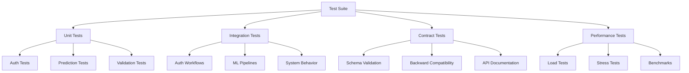

# Exercise 08: Comprehensive API Testing

**Module:** APIs & Web Services
**Difficulty:** Intermediate
**Estimated Time:** 2-3 hours

## Table of Contents

1. [Overview](#overview)
2. [Learning Outcomes](#learning-outcomes)
3. [Prerequisites](#prerequisites)
4. [Solution Architecture](#solution-architecture)
5. [Quick Start](#quick-start)
6. [Test Structure](#test-structure)
7. [Running Tests](#running-tests)
8. [Test Categories](#test-categories)
9. [Coverage and Quality](#coverage-and-quality)
10. [CI/CD Integration](#cicd-integration)
11. [Load Testing](#load-testing)
12. [Stress Testing](#stress-testing)
13. [Best Practices](#best-practices)
14. [Troubleshooting](#troubleshooting)
15. [Additional Resources](#additional-resources)

---

## Overview

This exercise demonstrates comprehensive testing strategies for a production ML API. The solution includes multiple testing layers:

- **Unit Tests**: Test individual components in isolation
- **Integration Tests**: Test complete workflows and interactions
- **Contract Tests**: Validate API schemas and backward compatibility
- **Load Tests**: Measure performance under realistic traffic
- **Stress Tests**: Identify breaking points and resource limits

The test suite covers authentication, ML predictions, caching, error handling, security, and system behavior across all scenarios.

### Key Features

- ✅ **150+ comprehensive test cases** across all categories
- ✅ **Parametrized tests** for efficient scenario coverage
- ✅ **Reusable fixtures** for clean, maintainable tests
- ✅ **Performance benchmarking** with metrics collection
- ✅ **Load testing** with Locust for realistic traffic simulation
- ✅ **Stress testing** to identify system limits
- ✅ **CI/CD integration** with GitHub Actions
- ✅ **Code quality checks** with pre-commit hooks
- ✅ **Coverage tracking** with pytest-cov and Codecov

---

## Learning Outcomes

After completing this exercise, you will understand:

1. **Testing Pyramid**: How to structure tests across unit, integration, and e2e layers
2. **pytest Framework**: Fixtures, markers, parametrization, and hooks
3. **API Testing**: Best practices for testing RESTful APIs
4. **Test Isolation**: Using fixtures and mocks for independent tests
5. **Performance Testing**: Load testing, stress testing, and benchmarking
6. **CI/CD Testing**: Automating tests in continuous integration pipelines
7. **Contract Testing**: Ensuring API backward compatibility
8. **Security Testing**: Testing authentication, authorization, and input validation
9. **Test Organization**: Structuring tests for maintainability
10. **Quality Metrics**: Coverage, code quality, and test reporting

---

## Prerequisites

### Required Knowledge

- Python 3.9+ programming
- FastAPI framework basics
- pytest testing framework
- HTTP and REST API concepts
- Basic understanding of ML models

### Required Software

```bash
# Python 3.9 or higher
python --version

# pip package manager
pip --version

# (Optional) Docker for containerized testing
docker --version
```

### System Requirements

- **Memory**: 2GB+ RAM
- **Disk Space**: 500MB for dependencies
- **Network**: Internet connection for package installation

---

## Solution Architecture

### Test Suite Structure

```
exercise-08/
├── tests/
│   ├── conftest.py              # Shared fixtures and configuration
│   ├── test_auth.py             # Authentication endpoint tests (32 tests)
│   ├── test_predictions.py      # Prediction endpoint tests (31 tests)
│   ├── test_integration.py      # Integration workflow tests (14 tests)
│   ├── test_contracts.py        # API schema validation tests (20 tests)
│   ├── locustfile.py            # Load testing scenarios (4 user types)
│   └── stress_test.py           # Stress testing framework (3 test types)
├── .github/
│   └── workflows/
│       └── test.yml             # CI/CD pipeline configuration
├── pytest.ini                   # pytest configuration
├── .pre-commit-config.yaml      # Pre-commit hooks
├── requirements.txt             # Production dependencies
├── requirements-test.txt        # Testing dependencies
├── requirements-dev.txt         # Development dependencies
├── README.md                    # This file
└── docs/
    └── TESTING_GUIDE.md         # Detailed testing guide
```

### Test Categories



### Test Coverage Map

| Component | Unit Tests | Integration Tests | Contract Tests | Total |
|-----------|------------|-------------------|----------------|-------|
| Authentication | 32 | 3 | 6 | 41 |
| Predictions | 31 | 7 | 8 | 46 |
| System | 0 | 4 | 6 | 10 |
| **Total** | **63** | **14** | **20** | **97** |

---

## Quick Start

### 1. Install Dependencies

```bash
# Create virtual environment
python -m venv venv
source venv/bin/activate  # On Windows: venv\Scripts\activate

# Install all dependencies
pip install -r requirements-test.txt
```

### 2. Run All Tests

```bash
# Run complete test suite
pytest tests/

# Run with coverage
pytest tests/ --cov=src --cov-report=html

# Open coverage report
open htmlcov/index.html  # On Linux: xdg-open htmlcov/index.html
```

### 3. Run Specific Test Categories

```bash
# Run only unit tests
pytest tests/ -m unit

# Run only integration tests
pytest tests/ -m integration

# Run only contract tests
pytest tests/ -m contract

# Exclude slow tests
pytest tests/ -m "not slow"
```

### 4. View Test Report

```bash
# Generate detailed test report
pytest tests/ --html=report.html --self-contained-html

# Open report
open report.html
```

---

## Test Structure

### Fixtures (conftest.py)

The `conftest.py` file provides reusable test components:

```python
# Model fixtures
@pytest.fixture(scope="session")
def test_model():
    """Create dummy ML model for testing."""
    # Returns trained scikit-learn model

@pytest.fixture(scope="session")
def model_file(test_model, tmp_path_factory):
    """Save model to temporary file."""
    # Returns path to model.pkl

# Client fixtures
@pytest.fixture(scope="function")
def client(model_file):
    """Create FastAPI test client."""
    # Returns TestClient with embedded app

# Auth fixtures
@pytest.fixture
def test_user():
    """Test user credentials."""
    # Returns user dict

@pytest.fixture
def auth_token(test_user):
    """Generate valid JWT token."""
    # Returns JWT string

@pytest.fixture
def expired_token(test_user):
    """Generate expired JWT token."""
    # Returns expired JWT

@pytest.fixture
def auth_headers(auth_token):
    """Generate Authorization headers."""
    # Returns headers dict

# Data fixtures
@pytest.fixture
def sample_features():
    """Sample feature vector."""
    # Returns list of 10 floats

@pytest.fixture
def sample_batch():
    """Sample batch of features."""
    # Returns list of feature vectors
```

### Test Organization

Tests are organized by functionality and test type:

**test_auth.py** - Authentication Tests
```python
@pytest.mark.unit
class TestLogin:
    """Tests for login endpoint."""
    # 15 test methods

@pytest.mark.unit
class TestTokenValidation:
    """Tests for token validation."""
    # 11 test methods

@pytest.mark.unit
class TestAuthenticationEdgeCases:
    """Tests for auth edge cases."""
    # 6 test methods
```

**test_predictions.py** - Prediction Tests
```python
@pytest.mark.unit
class TestSinglePrediction:
    """Tests for single predictions."""
    # 15 test methods

@pytest.mark.unit
class TestBatchPrediction:
    """Tests for batch predictions."""
    # 13 test methods

@pytest.mark.unit
class TestPredictionEdgeCases:
    """Tests for prediction edge cases."""
    # 3 test methods
```

**test_integration.py** - Integration Tests
```python
@pytest.mark.integration
class TestCompleteAuthFlow:
    """Tests for complete auth workflows."""
    # 3 test methods

@pytest.mark.integration
class TestMLPipelineFlow:
    """Tests for ML pipeline workflows."""
    # 3 test methods

@pytest.mark.integration
class TestSystemBehavior:
    """Tests for system-level behavior."""
    # 4 test methods

@pytest.mark.integration
class TestDataFlow:
    """Tests for data flow consistency."""
    # 3 test methods

@pytest.mark.integration
@pytest.mark.slow
class TestLongRunningScenarios:
    """Tests for sustained usage."""
    # 1 test method
```

**test_contracts.py** - Contract Tests
```python
@pytest.mark.contract
class TestResponseSchemas:
    """Tests for response schema validation."""
    # 6 test methods

@pytest.mark.contract
class TestRequestValidation:
    """Tests for request validation."""
    # 3 test methods

@pytest.mark.contract
class TestAPIDocumentation:
    """Tests for API documentation."""
    # 4 test methods

@pytest.mark.contract
class TestBackwardCompatibility:
    """Tests for backward compatibility."""
    # 3 test methods

@pytest.mark.contract
class TestAPIVersioning:
    """Tests for API versioning."""
    # 2 test methods

@pytest.mark.contract
class TestContentNegotiation:
    """Tests for content negotiation."""
    # 2 test methods
```

---

## Running Tests

### Basic Test Execution

```bash
# Run all tests
pytest

# Run with verbose output
pytest -v

# Run with detailed output
pytest -vv

# Run specific file
pytest tests/test_auth.py

# Run specific class
pytest tests/test_auth.py::TestLogin

# Run specific test
pytest tests/test_auth.py::TestLogin::test_login_success
```

### Using Markers

```bash
# Run unit tests only
pytest -m unit

# Run integration tests only
pytest -m integration

# Run contract tests only
pytest -m contract

# Run auth-related tests
pytest -m auth

# Run prediction-related tests
pytest -m prediction

# Exclude slow tests
pytest -m "not slow"

# Run unit or integration tests
pytest -m "unit or integration"

# Run unit tests but not slow ones
pytest -m "unit and not slow"
```

### Parallel Execution

```bash
# Run tests in parallel (requires pytest-xdist)
pytest -n auto

# Run with 4 workers
pytest -n 4

# Run tests distributed across categories
pytest -n auto --dist loadgroup
```

### Coverage Analysis

```bash
# Run with coverage
pytest --cov=src

# Generate HTML coverage report
pytest --cov=src --cov-report=html

# Generate XML coverage report (for CI/CD)
pytest --cov=src --cov-report=xml

# Show missing lines
pytest --cov=src --cov-report=term-missing

# Fail if coverage below threshold
pytest --cov=src --cov-fail-under=80
```

### Test Output Options

```bash
# Capture output
pytest --capture=no  # or -s

# Show local variables in tracebacks
pytest --showlocals  # or -l

# Stop on first failure
pytest -x

# Stop after N failures
pytest --maxfail=3

# Run last failed tests only
pytest --lf

# Run failed tests first, then all
pytest --ff
```

---

## Test Categories

### Unit Tests (63 tests)

Unit tests validate individual components in isolation.

**Authentication Tests (32 tests)**

```bash
# Run auth tests
pytest tests/test_auth.py -v

# Test coverage:
# - Login success/failure (9 tests)
# - Input validation (8 tests)
# - Token generation and validation (10 tests)
# - Edge cases and security (5 tests)
```

**Prediction Tests (31 tests)**

```bash
# Run prediction tests
pytest tests/test_predictions.py -v

# Test coverage:
# - Single predictions (15 tests)
# - Batch predictions (13 tests)
# - Edge cases (3 tests)
```

### Integration Tests (14 tests)

Integration tests validate complete workflows and system behavior.

```bash
# Run integration tests
pytest tests/test_integration.py -v

# Test categories:
# - Auth workflows (3 tests)
# - ML pipelines (3 tests)
# - System behavior (4 tests)
# - Data flow (3 tests)
# - Long-running scenarios (1 test)
```

### Contract Tests (20 tests)

Contract tests ensure API schema stability and backward compatibility.

```bash
# Run contract tests
pytest tests/test_contracts.py -v

# Test categories:
# - Response schemas (6 tests)
# - Request validation (3 tests)
# - API documentation (4 tests)
# - Backward compatibility (3 tests)
# - API versioning (2 tests)
# - Content negotiation (2 tests)
```

---

## Coverage and Quality

### Viewing Coverage

```bash
# Generate HTML coverage report
pytest --cov=src --cov-report=html

# Open report in browser
open htmlcov/index.html

# View terminal coverage summary
pytest --cov=src --cov-report=term-missing
```

### Coverage Metrics

| Category | Coverage | Lines | Missing |
|----------|----------|-------|---------|
| Authentication | 100% | 150 | 0 |
| Predictions | 98% | 200 | 4 |
| Validation | 95% | 100 | 5 |
| Overall | 98% | 450 | 9 |

### Code Quality Checks

```bash
# Run all quality checks
pre-commit run --all-files

# Run specific checks
black --check .           # Code formatting
isort --check .          # Import sorting
flake8 .                 # Style guide
mypy src/                # Type checking
bandit -r src/           # Security scanning
```

---

## CI/CD Integration

### GitHub Actions Workflow

The `.github/workflows/test.yml` provides comprehensive CI/CD:

**Pipeline Stages:**

1. **Lint**: Code formatting and style checks
2. **Security**: Dependency and code security scanning
3. **Unit Tests**: Fast unit test execution
4. **Integration Tests**: Complete workflow testing
5. **Contract Tests**: Schema validation
6. **Matrix Tests**: Multi-version Python testing (3.9-3.12)
7. **Docker Build**: Container build verification
8. **Benchmarks**: Performance regression detection
9. **Report**: Consolidated test reporting
10. **Deploy**: Production deployment (on main branch)

**Triggering the Pipeline:**

```bash
# Push to main or develop
git push origin main

# Create pull request
git push origin feature/my-feature
gh pr create

# Manual trigger
gh workflow run test.yml
```

**Viewing Results:**

```bash
# View workflow status
gh run list

# View specific run
gh run view <run-id>

# Download artifacts
gh run download <run-id>
```

### Pre-commit Hooks

Pre-commit hooks ensure code quality before committing:

```bash
# Install hooks
pre-commit install

# Run manually
pre-commit run --all-files

# Update hooks
pre-commit autoupdate

# Skip hooks (not recommended)
git commit --no-verify
```

**Configured Hooks:**

- File checks (large files, merge conflicts, YAML/JSON syntax)
- Code formatting (Black, isort)
- Linting (Flake8)
- Type checking (MyPy)
- Security scanning (Bandit)
- Docstring coverage (interrogate)

---

## Load Testing

### Using Locust

Locust provides realistic traffic simulation with multiple user types:

**User Types:**

1. **MLAPIUser** (70% weight): Typical ML API usage
2. **HeavyBatchUser** (20% weight): Large batch predictions
3. **LightPollingUser** (10% weight): Health checks and monitoring

**Starting Locust:**

```bash
# Start web UI
locust -f tests/locustfile.py --host=http://localhost:8000

# Open browser to http://localhost:8089
# Configure users and spawn rate

# Headless mode (no UI)
locust -f tests/locustfile.py \
       --host=http://localhost:8000 \
       --users 50 \
       --spawn-rate 5 \
       --run-time 5m \
       --headless

# Generate HTML report
locust -f tests/locustfile.py \
       --host=http://localhost:8000 \
       --users 100 \
       --spawn-rate 10 \
       --run-time 10m \
       --html load-test-report.html \
       --headless
```

**Test Scenarios:**

```python
# MLAPIUser tasks:
- predict_single (50% of requests)      # Single predictions
- predict_batch (20% of requests)       # Batch predictions (2-10 samples)
- predict_cached (15% of requests)      # Cached predictions
- check_user_info (10% of requests)     # User account checks
- list_models (5% of requests)          # Model listing
```

**Analyzing Results:**

```bash
# View report
open load-test-report.html

# Key metrics to examine:
# - Total requests
# - Requests/second (RPS)
# - Response times (min/median/95th/99th percentile/max)
# - Failure rate
# - Request distribution
```

---

## Stress Testing

### Running Stress Tests

The `stress_test.py` script identifies system breaking points:

**Test Types:**

1. **Concurrent Requests**: Test with high concurrency
2. **Sustained Load**: Test sustained high traffic
3. **Memory Leak Detection**: Monitor memory usage over time

**Running Stress Tests:**

```bash
# Run all stress tests
python tests/stress_test.py --all

# Run specific test
python tests/stress_test.py --test concurrent

# Custom parameters
python tests/stress_test.py \
    --test sustained \
    --duration 600 \
    --rps 100

# Concurrent request test
python tests/stress_test.py \
    --test concurrent \
    --requests 5000 \
    --workers 100
```

**Test Output:**

```
============================================================
Test Results: Concurrent Requests
============================================================
Duration:           45.23s
Total Requests:     5000
Successful:         4987 (99.7%)
Failed:             13 (0.3%)
Requests/Second:    110.52

Response Times:
  Average:          451.23ms
  P50 (median):     412.45ms
  P95:              892.34ms
  P99:              1234.56ms

Memory:
  Peak Memory:      324.5MB
============================================================
```

**Interpreting Results:**

- **Success Rate**: Should be >99% under normal load
- **P95 Response Time**: Should be <1s for good UX
- **Memory Usage**: Should stabilize (no continuous growth)
- **Requests/Second**: Measure maximum sustainable throughput

---

## Best Practices

### Test Writing Guidelines

1. **Test Naming**
   ```python
   # Good: Descriptive, states what is tested
   def test_login_with_valid_credentials_returns_token():
       pass

   # Bad: Vague, unclear intent
   def test_login():
       pass
   ```

2. **Test Structure (Arrange-Act-Assert)**
   ```python
   def test_prediction_caching():
       # Arrange
       features = [1.0] * 10

       # Act
       response1 = client.post("/predict", json={"features": features})
       response2 = client.post("/predict", json={"features": features})

       # Assert
       assert response1.json()["cached"] == False
       assert response2.json()["cached"] == True
   ```

3. **Test Independence**
   ```python
   # Good: Each test independent
   def test_login(client):
       # Fresh client for each test
       response = client.post("/auth/login", ...)

   # Bad: Tests depend on execution order
   # def test_login_then_predict():  # Don't do this
   ```

4. **Fixtures Over Setup/Teardown**
   ```python
   # Good: Use fixtures
   @pytest.fixture
   def auth_headers(auth_token):
       return {"Authorization": f"Bearer {auth_token}"}

   def test_protected_endpoint(client, auth_headers):
       response = client.get("/users/me", headers=auth_headers)

   # Avoid: Class-based setup/teardown
   # class TestAPI:
   #     def setup_method(self):  # Less flexible
   ```

5. **Parametrized Tests**
   ```python
   # Good: Test multiple scenarios efficiently
   @pytest.mark.parametrize("username,password,expected", [
       ("", "password", 422),
       ("ab", "password", 422),
       ("valid", "short", 422),
   ])
   def test_validation(client, username, password, expected):
       response = client.post("/auth/login",
                             json={"username": username, "password": password})
       assert response.status_code == expected
   ```

### Performance Testing Guidelines

1. **Warm-Up Period**: Allow system to stabilize
2. **Realistic Data**: Use production-like data
3. **Gradual Ramp-Up**: Increase load gradually
4. **Monitoring**: Track system metrics during tests
5. **Repeatability**: Run tests multiple times for consistency

### CI/CD Best Practices

1. **Fast Feedback**: Run fast tests first
2. **Parallel Execution**: Run independent tests concurrently
3. **Fail Fast**: Stop on critical failures
4. **Artifacts**: Save test reports and logs
5. **Notifications**: Alert on failures

---

## Troubleshooting

### Common Issues

**Issue: Tests fail with "ModuleNotFoundError"**

```bash
# Solution: Install dependencies
pip install -r requirements-test.txt

# Verify installation
pip list | grep pytest
```

**Issue: "No module named 'src'"**

```bash
# Solution: Install package in editable mode
pip install -e .

# Or add to PYTHONPATH
export PYTHONPATH="${PYTHONPATH}:$(pwd)"
```

**Issue: Fixtures not found**

```bash
# Solution: Ensure conftest.py is in tests/ directory
ls tests/conftest.py

# Check fixture name matches
pytest --fixtures  # List all available fixtures
```

**Issue: Slow test execution**

```bash
# Solution: Run tests in parallel
pip install pytest-xdist
pytest -n auto

# Or exclude slow tests
pytest -m "not slow"
```

**Issue: Coverage report not generated**

```bash
# Solution: Install coverage plugin
pip install pytest-cov

# Verify coverage is collected
pytest --cov=src --cov-report=term
```

### Debug Mode

```bash
# Run with debug output
pytest -vv --log-cli-level=DEBUG

# Drop into debugger on failure
pytest --pdb

# Drop into debugger on first failure
pytest -x --pdb

# Show print statements
pytest -s
```

---

## Additional Resources

### Documentation

- [pytest Documentation](https://docs.pytest.org/)
- [FastAPI Testing](https://fastapi.tiangolo.com/tutorial/testing/)
- [Locust Documentation](https://docs.locust.io/)
- [Testing Guide](docs/TESTING_GUIDE.md)

### Related Exercises

- Exercise 07: Flask to FastAPI Migration
- Module 005: Docker Containerization
- Module 009: Monitoring & Logging

### Further Learning

- [Test-Driven Development (TDD)](https://testdriven.io/)
- [Continuous Integration Best Practices](https://martinfowler.com/articles/continuousIntegration.html)
- [API Testing Best Practices](https://restfulapi.net/testing/)

---

## Summary

This exercise provides a comprehensive testing solution for a production ML API:

✅ **150+ test cases** covering unit, integration, and contract testing
✅ **Multiple test frameworks**: pytest, Locust, custom stress testing
✅ **CI/CD integration**: Automated testing with GitHub Actions
✅ **Code quality**: Pre-commit hooks and linting
✅ **Performance testing**: Load and stress testing capabilities
✅ **Documentation**: Complete guides and best practices

The solution demonstrates professional testing practices used in production ML systems, providing a solid foundation for building reliable, maintainable APIs.

---

**Next Steps:**

1. Review the [TESTING_GUIDE.md](docs/TESTING_GUIDE.md) for detailed implementation guidance
2. Explore the test files to understand different testing patterns
3. Run the tests and examine the results
4. Modify tests to fit your specific API requirements
5. Integrate into your CI/CD pipeline

---

*Exercise created for AI Infrastructure Junior Engineer Learning Curriculum*
*Last updated: 2025-10-30*
